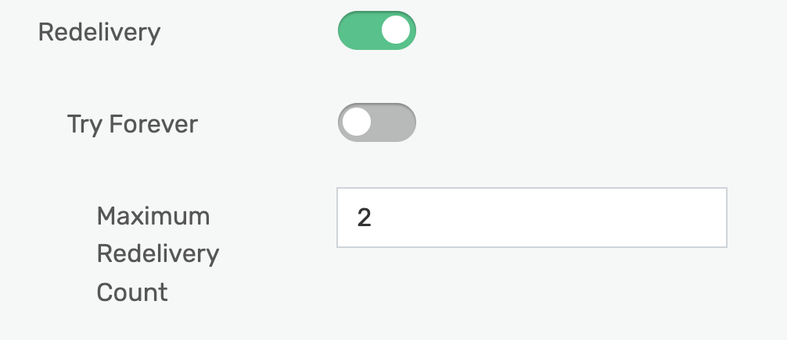
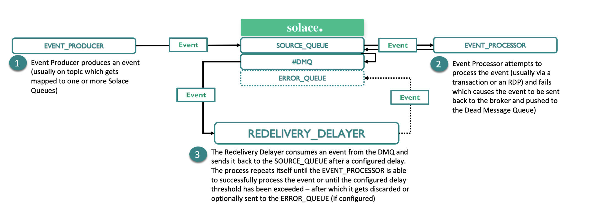

# SOLACE REDELIVERY DELAYER 

## Overview
The purpose of this microservice is to implement an exponential backoff from a Solace DMQ back to the original queue.


### Getting started quickly
1. Edit [src/main/resource/application.properties](src/main/resources/application.properties) with values for your environment.

2. Ensure that your configured SOURCE_QUEUE has a maximum redelivery configured:




3. Then run `mvn spring-boot:run`

You should see the following message:

```

c.s.j.protocol.impl.TcpClientChannel     : Client-1: Connecting to host 'orig=tcp:solacehost:port, scheme=tcp:, host=solacehost, port=port' (host 1 of 1, smfclient 1, attempt 1 of 1, this_host_attempt: 1 of 1)
c.s.jcsmp.impl.JCSMPBasicSession         : Client-1: AdCtrl version changes: 2->4
c.s.j.protocol.impl.TcpClientChannel     : Client-1: Connected to host 'orig=tcp:solacehost:port, scheme=tcp:, host=solacehost, port=port' (smfclient 1)
c.s.r.api.ISolaceMessagingService        : Starting consumer on #DMQ

```

## Documentation

If a consumer fails to process a message, it is immediately sent back to the queue and re-delivered back to the consumer.
This could potentially result in a DOS-like attack against the endpoint. Perhaps you want to retry processing a
message after a certain interval, have an exponential backoff in case of further failures and have a threshold after which
you will stop processing messages all together.


The diagram above describes the flow of this application. You will have a SOURCE_QUEUE, a DMQ (for the SOURCE_QUEUE) and an optional ERROR_QUEUE.

1. A message on the SOURCE_QUEUE can be redelivered N number of times before it is expired to the DMQ
2. The redelivery delayer microservice listens to the DMQ and injects a configurable header that counts the number
of times it has been sent for reprocessing. It will use a configurable exponential backoff factor before send it back to
the SOURCE_QUEUE   
3. If the message exceeds the threshold of the MAXIMUM delay, the microservice will either discard the message or send it to
an optionally configured ERROR_QUEUE for processing


## Resources

For more information try these resources:

- The Solace Developer Portal website at: https://solace.dev
- Ask the [Solace Community](https://solace.community)

## Contributing

Please read [CONTRIBUTING.md](CONTRIBUTING.md) for details on our code of conduct, and the process for submitting pull requests to us.

## Authors

See the list of [contributors](https://github.com/TKTheTechie/solace-redelivery-delayer/graphs/contributors) who participated in this project.

## License

See the [LICENSE](LICENSE) file for details.